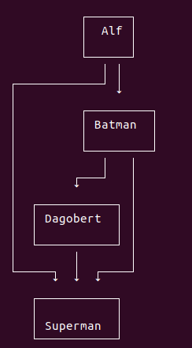

# terminal-graphs

Tool that allows drawing graphs (usually DAGs) in the terminal. It
can handle a restricted subset of dot-files
(we use [graphlib-dot](https://github.com/cpettitt/graphlib-dot) to parse
the dot files). And it can work with [Klay JSON Graphs](https://rtsys.informatik.uni-kiel.de/confluence/display/KIELER/JSON+Graph+Format)..

# Installation

Via npm:

```
npm install terminal-graphs
```

# Usage

This package has a CLI interface and an API.

## CLI

You can install the `terminal-graphs` package globally
(`npm i -g terminal-graphs`). After this you can run it in the
terminal via:

```
terminal-graphs --dot someGraph.dot
cat someGraph.dot | terminal-graphs --dot
terminal-graphs someKlayGraph.json
cat someKlayGraph.json | terminal-graphs
```

If you do not pass any arguments it will prompt you for an input.

## API

The package exports two functions `render` and `renderDot`. Both
return a Promise that will return the graph as a string.

```
var termGraphs = require('terminal-graphs')

termGraphs.renderDot('digraph { A -> B }')
.then((res) => console.log(res))

termGraphs.render({...Klay Graph...})
.then((res) => console.log(res))
```

# Output

The output looks like this:


